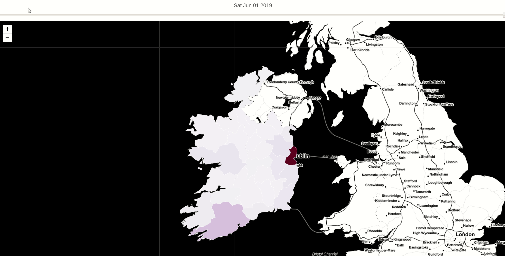

## Introduction
This notebook presents different techniques on visualizing data using  Choropleth maps with [folium](https://python-visualization.github.io/folium/). Folium easily allows to manipulate data in Python and then visualize it in a Leaflet map.

Data used for this demo is property prices in Ireland and can be downloaded from [Property Price Register offical site](https://www.propertypriceregister.ie/)

The main goal was to use Folium Choropleth Map with a Time Slider that would show how average property prices have evolved month over month and what were the most expensive areas.

Working example: 
